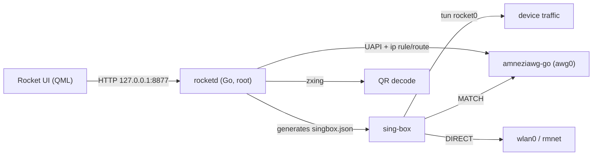

# Rocket for Ubuntu Touch

A Shadowrocket-style proxy client for **Ubuntu Touch 24.04** (aarch64 / Lomiri).
Supports VLESS, VMess, Shadowsocks, Trojan, SOCKS5, HTTP, SSH and **AmneziaWG**,
reads Shadowrocket `.conf` files, handles subscriptions, decodes QR codes with the
camera, shows a live connection log and lets you turn any log entry into a routing rule.

🇷🇺 [Русская версия ниже](#rocket-для-ubuntu-touch) · 🇬🇧 English version first.

---

## Features

- **Protocols**: `vless` (TLS / REALITY / uTLS / ws / grpc / http / httpupgrade),
  `vmess`, `shadowsocks`, `trojan`, `socks5`, `http`, `ssh`, `amneziawg`.
- **Shadowrocket `.conf`** — `[General]`, `[Proxy]`, `[Proxy Group]`, `[Rule]`, `[Host]`,
  including `RULE-SET` (downloaded and cached), `GEOIP`, port ranges and IDN domains.
- **Subscriptions** — `sub://` share links, base64 blobs, plain URI lists or a remote
  `.conf`; refresh keeps the active node and measured latencies.
- **QR import** — live camera scan or QR from an image file; the decoded payload can be
  imported as node(s) or added as a subscription.
- **Rule editing** — structured editor (add / edit / reorder / delete, order = priority)
  **and** raw `.conf` text editing in the same app.
- **Connection log** — every connection with the matched rule and chosen policy; tap an
  entry to add a `DOMAIN` / `DOMAIN-SUFFIX` / `IP-CIDR` rule for it.
- **Routing modes** — `config` (rules from `.conf`), `proxy` (everything through the node),
  `direct`.
- **Bilingual UI** — English / Russian, picked from the system locale.

## How it works



- A **click app** (QML) is the UI. It cannot gain root, so all privileged work lives in
  **`rocketd`**, a root systemd service exposing a JSON API on `127.0.0.1:8877` only.
- `rocketd` translates a Shadowrocket `.conf` into a `sing-box` configuration and runs
  `sing-box` with a TUN inbound (`rocket0`) that owns device routing.
- **AmneziaWG is a regular outbound**, so `.conf` rules apply to it. `amneziawg-go` brings
  up `awg0` without touching the main routing table (no `awg-quick`, no `Table` handling);
  `rocketd` installs a dedicated table plus `ip rule`s, and the AWG outbound is a `direct`
  outbound with `routing_mark` **and** `bind_interface: awg0`. MATCH → AWG, DIRECT →
  physical interface, REJECT → blocked — and the connection log keeps working for AWG too.
- No nftables is used: the target kernel has `CONFIG_NF_TABLES` disabled, so `auto_redirect`
  and `strict_route` stay off and everything is done with iproute2 + fwmark.

## Requirements

- Ubuntu Touch 24.04 (Lomiri, systemd), **aarch64** — armhf is not supported.
- A writable root filesystem for installation (`sudo mount -o remount,rw /`).
- `adb` access from a workstation.

## Install

Download `rocket_<version>_all.click` and `rocketd` from a release (or build them, below),
then on the device:

```bash
adb push rocket_0.1.0_all.click rocketd scripts/install.sh /home/phablet/Downloads/
adb shell
sudo bash /home/phablet/Downloads/install.sh
```

`install.sh` remounts `/` read-write, installs `rocketd` to `/usr/local/bin`, creates and
enables the `rocketd.service` unit, installs the click package, runs `aa-clickhook -f` and
puts `/` back to read-only. Afterwards tap the **Rocket** icon in the launcher.

Verify:

```bash
adb shell 'systemctl is-active rocketd'
adb shell 'wget -q -O- http://127.0.0.1:8877/status'
```

> A default RU-oriented routing template (`.ru`, `.рф`, `GEOIP,RU` → DIRECT, everything
> else → PROXY) is shipped inside the click and seeded on a clean install.

## Build from source

Requires Go ≥ 1.24 on the workstation. macOS and Linux hosts both work.

```bash
git clone git@github.com:TurboSailor/Rocket-UT.git
cd Rocket-UT

# Binary dependencies -> vendor-bin/ (not stored in git).
# sing-box is downloaded, amneziawg-go is cross-compiled from source.
# awg + zxing are prebuilt aarch64 binaries: point AWG_BIN_DIR at them.
AWG_BIN_DIR=/path/to/prebuilt/bin make bins

make test     # unit tests; also validates generated configs with a real sing-box
make click    # builds rocket_<ver>_all.click (ar + tar, no click(1) needed)
make deploy   # adb push + run install.sh on the device
```

`make click` assembles the package manually, so no `click` tool is required — handy on
macOS. `UT_PASS` overrides the device sudo password used by `make deploy`.

## HTTP API (`127.0.0.1:8877`)

| Method | Endpoint | Purpose |
|---|---|---|
| GET | `/status` | state, active node, traffic, warnings |
| GET/POST | `/up`, `/down` | bring the stack up / down |
| GET/POST | `/mode?v=config\|proxy\|direct` | routing mode |
| GET | `/nodes` | list nodes |
| POST | `/nodes/import?name=` | import URIs / `sub://` links / Shadowrocket `.conf` / AmneziaWG `.conf` |
| POST | `/nodes/select?id=`, `/nodes/delete?id=`, `/nodes/test?id=` | activate / delete / measure |
| GET | `/subs` | list subscriptions |
| POST | `/subs/add?name=&url=`, `/subs/update?id=`, `/subs/delete?id=` | manage subscriptions |
| GET | `/confs`, `/conf?name=` | list configs / read one |
| POST | `/conf?name=`, `/conf/select?name=`, `/conf/delete?name=`, `/conf/fromurl?name=&url=` | write / activate / delete / fetch |
| GET | `/rules` | parsed rules of the active config |
| POST | `/rules/add`, `/rules/update?line=`, `/rules/delete?line=`, `/rules/move?line=&dir=up\|down` | edit rules |
| GET | `/log?since=` | connection log |
| POST | `/qrdecode` | decode a QR image (body = path) |
| GET/POST | `/listdir?path=`, `/readfile` | file browsing, restricted to `~/Downloads`, `~/Documents`, `~/Pictures` |

## Verified on device

Tested on a Spacewar running UT 24.04 (`24.04-2.x/arm64/android9plus`, kernel 5.4):

- All of socks5 / http / vless / vmess / ssh carry real traffic — confirmed on the server
  side per protocol (`mixed-in`, `vless-in`, `vmess-in`, ssh `direct-tcpip`).
- Rule precedence: with the proxy up a PROXY-matched host works; with the proxy killed the
  same host fails while DIRECT-matched hosts keep working.
- Log → rule: adding a rule from a log entry flips that host's route immediately.
- AmneziaWG: real handshake, obfuscation preserved (`Jc/Jmin/Jmax/S1/S2/H1..H4`),
  `ip rule` 8800/8801 below sing-box's own rules, MATCH traffic leaves through `awg0`.
- Subscriptions: base64 lists parsed, active node preserved across refresh.
- Real-world `.conf` with 19 `RULE-SET`s: ~3000 matchers, starts in under a second.

Not verified: full internet egress through a third-party AmneziaWG server (the test peer
ran on the device itself over loopback, so it had no NAT).

## Known limitations

- Not supported from Shadowrocket configs (reported in the UI as skipped lines):
  `[URL Rewrite]`, `[MITM]`, `IP-ASN`, `USER-AGENT`, `URL-REGEX`, `PROCESS-NAME`,
  `policy-regex-filter`, Shadowsocks `plugin=`.
- `fallback` and `load-balance` proxy groups are mapped to sing-box `urltest`.
- Changing rules restarts `sing-box`, so existing connections drop.
- One active node at a time (proxy groups inside a `.conf` still work).
- aarch64 only.

## Third-party components

| Component | Licence | Use |
|---|---|---|
| [sing-box](https://github.com/SagerNet/sing-box) | GPL-3.0 | proxy core, TUN, routing |
| [amneziawg-go](https://github.com/amnezia-vpn/amneziawg-go) | MIT | AmneziaWG userspace |
| [amneziawg-tools](https://github.com/amnezia-vpn/amneziawg-tools) (`awg`) | GPL-2.0 | AWG configuration CLI |
| [zxing-cpp](https://github.com/zxing-cpp/zxing-cpp) | Apache-2.0 | QR decoding |

`rocketd` itself depends only on the Go standard library.

---

# Rocket для Ubuntu Touch

Клиент прокси в духе Shadowrocket для **Ubuntu Touch 24.04** (aarch64 / Lomiri).
Поддерживает VLESS, VMess, Shadowsocks, Trojan, SOCKS5, HTTP, SSH и **AmneziaWG**,
читает `.conf` формата Shadowrocket, работает с подписками, распознаёт QR-коды камерой,
ведёт журнал соединений и позволяет одним тапом превратить запись журнала в правило.

## Возможности

- **Протоколы**: `vless` (TLS / REALITY / uTLS / ws / grpc / http / httpupgrade),
  `vmess`, `shadowsocks`, `trojan`, `socks5`, `http`, `ssh`, `amneziawg`.
- **`.conf` Shadowrocket** — секции `[General]`, `[Proxy]`, `[Proxy Group]`, `[Rule]`,
  `[Host]`, включая `RULE-SET` (скачивается и кэшируется), `GEOIP`, диапазоны портов
  и IDN-домены.
- **Подписки** — ссылки `sub://`, base64, списки ссылок или удалённый `.conf`;
  обновление сохраняет активный узел и измеренные задержки.
- **Импорт по QR** — сканирование камерой или QR из картинки; распознанное можно
  импортировать как узлы либо добавить как подписку.
- **Правка правил** — структурный редактор (добавить / изменить / переставить / удалить,
  порядок = приоритет) **и** правка `.conf` обычным текстом в том же приложении.
- **Журнал соединений** — каждое соединение с сработавшим правилом и выбранной политикой;
  тап по записи добавляет для неё правило `DOMAIN` / `DOMAIN-SUFFIX` / `IP-CIDR`.
- **Режимы маршрутизации** — `config` (правила из `.conf`), `proxy` (всё через узел),
  `direct`.
- **Двуязычный интерфейс** — русский / английский по локали системы.

## Как это устроено

- **Click-приложение** (QML) — это только интерфейс. Root ему недоступен, поэтому все
  привилегированные операции живут в **`rocketd`** — systemd-сервисе от root с JSON API,
  слушающим исключительно `127.0.0.1:8877`.
- `rocketd` транслирует `.conf` Shadowrocket в конфигурацию `sing-box` и запускает
  `sing-box` с TUN-интерфейсом `rocket0`, который забирает трафик устройства.
- **AmneziaWG — обычный outbound**, поэтому правила `.conf` применяются и к нему.
  `amneziawg-go` поднимает `awg0`, не трогая основную таблицу маршрутизации (без
  `awg-quick` и без обработки `Table`); `rocketd` создаёт отдельную таблицу и правила
  `ip rule`, а AWG-outbound — это `direct` с `routing_mark` **и** `bind_interface: awg0`.
  MATCH → AWG, DIRECT → физический интерфейс, REJECT → блокировка, при этом журнал
  соединений и добавление правил работают и для AWG.
- nftables не используется: в целевом ядре `CONFIG_NF_TABLES` отключён, поэтому
  `auto_redirect` и `strict_route` выключены, а всё делается через iproute2 + fwmark.

## Требования

- Ubuntu Touch 24.04 (Lomiri, systemd), **aarch64** — armhf не поддерживается.
- Записываемый корень на время установки (`sudo mount -o remount,rw /`).
- Доступ по `adb` с рабочей машины.

## Установка

Возьмите `rocket_<версия>_all.click` и `rocketd` из релиза (или соберите — см. ниже), затем:

```bash
adb push rocket_0.1.0_all.click rocketd scripts/install.sh /home/phablet/Downloads/
adb shell
sudo bash /home/phablet/Downloads/install.sh
```

`install.sh` перемонтирует `/` на запись, положит `rocketd` в `/usr/local/bin`, создаст и
включит юнит `rocketd.service`, установит click-пакет, выполнит `aa-clickhook -f` и вернёт
`/` в режим только чтения. После этого тапните иконку **Rocket** в лончере.

Проверка:

```bash
adb shell 'systemctl is-active rocketd'
adb shell 'wget -q -O- http://127.0.0.1:8877/status'
```

> В пакет входит шаблон правил под РФ (`.ru`, `.рф`, `GEOIP,RU` → DIRECT, остальное →
> PROXY); на чистой установке он ставится конфигом по умолчанию.

## Сборка из исходников

Нужен Go ≥ 1.24. Работает и на macOS, и на Linux.

```bash
git clone git@github.com:TurboSailor/Rocket-UT.git
cd Rocket-UT

# Бинарные зависимости -> vendor-bin/ (в git не хранятся).
# sing-box скачивается, amneziawg-go кросс-компилируется из исходников.
# awg и zxing — готовые бинари под aarch64: укажите каталог в AWG_BIN_DIR.
AWG_BIN_DIR=/путь/к/бинарям make bins

make test     # юнит-тесты; конфиги дополнительно валидируются настоящим sing-box
make click    # собирает rocket_<версия>_all.click (ar + tar, без утилиты click)
make deploy   # adb push и запуск install.sh на устройстве
```

`make click` собирает пакет вручную, поэтому утилита `click` не требуется — это удобно на
macOS. Пароль sudo для `make deploy` задаётся переменной `UT_PASS`.

## Что проверено на устройстве

Проверено на Spacewar с UT 24.04 (`24.04-2.x/arm64/android9plus`, ядро 5.4):

- socks5 / http / vless / vmess / ssh проносят реальный трафик — подтверждено со стороны
  сервера по каждому протоколу (`mixed-in`, `vless-in`, `vmess-in`, ssh `direct-tcpip`).
- Приоритет правил: с поднятым прокси хост из правила PROXY работает; после остановки
  прокси он падает, а хосты по DIRECT продолжают работать.
- Журнал → правило: добавление правила из записи журнала сразу меняет маршрут этого хоста.
- AmneziaWG: настоящее рукопожатие, обфускация сохранена (`Jc/Jmin/Jmax/S1/S2/H1..H4`),
  правила `ip rule` 8800/8801 стоят раньше правил sing-box, трафик MATCH уходит в `awg0`.
- Подписки: base64-списки разбираются, активный узел сохраняется при обновлении.
- Реальный `.conf` с 19 `RULE-SET`: ~3000 матчеров, старт менее секунды.

Не проверялось: полный выход в интернет через сторонний сервер AmneziaWG — встречный пир
поднимался на самом устройстве через loopback, и NAT у него отсутствовал.

## Известные ограничения

- Не поддерживается из конфигов Shadowrocket (показывается в UI как пропущенные строки):
  `[URL Rewrite]`, `[MITM]`, `IP-ASN`, `USER-AGENT`, `URL-REGEX`, `PROCESS-NAME`,
  `policy-regex-filter`, `plugin=` у Shadowsocks.
- Группы `fallback` и `load-balance` отображаются в `urltest` из sing-box.
- Изменение правил перезапускает `sing-box`, поэтому текущие соединения рвутся.
- Один активный узел одновременно (группы политик внутри `.conf` при этом работают).
- Только aarch64.

## Сторонние компоненты

| Компонент | Лицензия | Назначение |
|---|---|---|
| [sing-box](https://github.com/SagerNet/sing-box) | GPL-3.0 | ядро прокси, TUN, маршрутизация |
| [amneziawg-go](https://github.com/amnezia-vpn/amneziawg-go) | MIT | AmneziaWG в userspace |
| [amneziawg-tools](https://github.com/amnezia-vpn/amneziawg-tools) (`awg`) | GPL-2.0 | CLI настройки AWG |
| [zxing-cpp](https://github.com/zxing-cpp/zxing-cpp) | Apache-2.0 | распознавание QR |

Сам `rocketd` использует только стандартную библиотеку Go.
